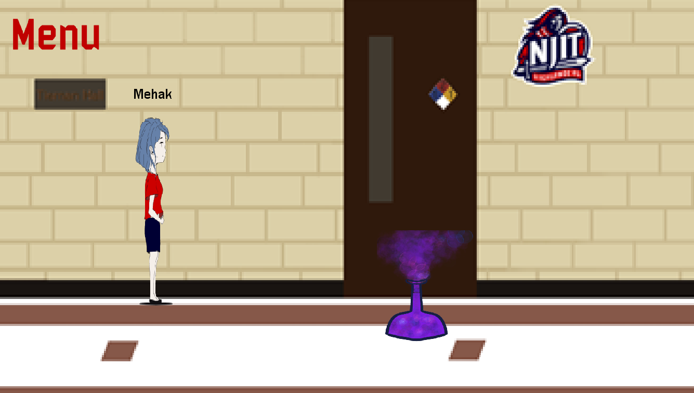

# NJIT-Campus-Simulation
A student effort to make a virtual campus tour fun for incoming students during the hard times of COVID-19.
Explore the NJIT campus on a game made using GameMaker Studio 2.0 using the following steps:

``clone the directory using terminal git commands. ``
``add the project to GameMaker Studio 2.0 ``

and start exploring!

   

  

Find our project timeline and contents, including a video of how the game looks, here:
https://docs.google.com/document/d/1GSNhFskN0_4Oo9Zm-kUws77gKy4GUh_338-k1HiHiiQ/edit?usp=sharing

Made by Mehakpreet, Jeet, Loumy and Maryam.
